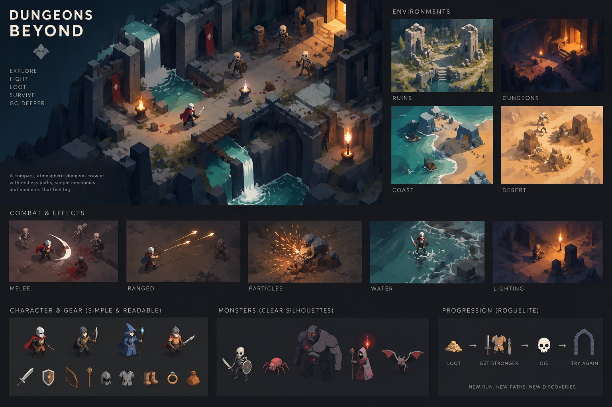

# Astralite — The Drowned Keep

> **Reference note:** The image above is a mood and art-direction reference, not a screenshot or a literal feature specification. It captures the desired readable isometric composition, ruined environments, dramatic lighting, clear combat silhouettes, and compact roguelite fantasy. The current game has its own drowned-fortress identity and focuses on melee combat rather than every character, weapon, biome, or feature shown in the reference.

## Overview

**Astralite — The Drowned Keep** is a compact isometric action roguelite played in the browser. The player is a lone knight descending through a flooded fortress whose rooms, paths, encounters, and landmarks are rebuilt for every run.

The experience is designed around a simple promise: **explore, fight, grow stronger, and go deeper**. Controls are intentionally small in number, but timing, positioning, enemy tells, branching routes, hazards, and temporary upgrades give each descent shape. A complete run spans three floors and can be finished in one focused session.

## Core loop

1. Enter a newly generated floor.
2. Follow the main route toward the stair while deciding which side chambers are worth exploring.
3. Fight skeleton guards, evade stalker pounces, and break through wardens.
4. Cleanse rooms to recover vitality and earn experience from enemies and optional detours.
5. Rank up and choose boons that improve the current run.
6. Defeat the wardens guarding the exit, review the floor results, and descend.
7. Escape after three floors—or fall, begin a new descent, or retry the same keep seed.

## The Drowned Keep

Each floor is a seeded, freely branching fortress rather than a fixed sequence of arenas. It contains roughly 10–24 rooms assembled from several footprints, connected by bent corridors, bridges, and occasional shortcuts. The critical route leads to the floor guardian chamber, while branches reward curiosity with experience, healing, and safer opportunities to prepare.

The keep mixes ruined stone halls, flooded passages, exposed coastal masonry, crypt-like chambers, wooden crossings, waterfalls, banners, braziers, broken walls, pillars, barrels, and scattered defensive remains. Animated tidal water, cloth, flame, embers, damp stone, torchlight, and cool exterior light give the procedural geometry a coherent sense of place.

Rooms are assigned encounter identities so exploration changes the immediate play pattern:

- **Watch rooms** present direct, readable combat.
- **Ambush rooms** wake hidden enemies after entry.
- **Gauntlets** place timed ember hazards across the arena.
- **Sanctuaries** contain a one-use healing shrine.
- **Warden chambers** block progress until their defenders fall.

## Combat and movement

Combat is deliberately built around two verbs: **strike** and **dash**. Movement is screen-relative, attacks can be held to repeat, and a dash can cancel a committed player attack. The knight’s swing has anticipation, contact, and recovery phases, allowing attacks to feel responsive without losing visual clarity. A directional slash, hit-stop, particles, sound, recoil, and enemy health bars communicate impact.

Enemy behavior is meant to be learned at a glance:

- **Guards** close distance and pressure the player with basic melee attacks.
- **Stalkers** line up a visible long-range pounce that rewards sidestepping.
- **Wardens** are larger, tougher enemies with wider reach, stronger blows, and committed attacks.

Enemy windups use visible cues, attacks require a clear path, and bodies keep enough separation to remain readable in groups. Damage briefly grants invulnerability, while hazards track their own flare cycle so overlapping threats remain consistent.

## Progression

Experience belongs to the current descent and resets when a new run begins. Defeated enemies and worthwhile side chambers advance the player’s rank. Each rank offers a choice of boons, including improvements to strike strength, reach, dash distance, healing on kills, maximum vitality, and damage resistance.

The game remembers the deepest descent, the seed of the current keep, settings, and a local history of completed runs. Run records include outcome, floor, playtime, rank, experience, kills, boons, and cause of defeat. This data stays in the browser and is not sent anywhere.

## Player experience

The permanent HUD stays intentionally minimal: vitality, dash readiness, and progress toward the next boon. Controls, journey statistics, settings, and the expanded floor map live in menus instead of competing with the playfield. Short room notices communicate meaningful events without turning objectives into a persistent overlay.

Keyboard and touch are first-class inputs. Keyboard bindings can be remapped, and touch supports either a continuous thumbstick or labelled direction buttons alongside separate dash and strike controls. Volume, mute, fullscreen, and reduced-motion settings are saved locally. Reduced motion removes camera shake and animated hurt pulsing while preserving combat timing.

## Direction and design principles

The project’s established principles are:

- **Compact, replayable runs** rather than a long campaign.
- **Readable action** over mechanical clutter or excessive effects.
- **Meaningful procedural variation** through topology, encounters, hazards, and landmarks—not randomness alone.
- **A minimal HUD** with deeper information available on demand.
- **Atmosphere through motion, light, sound, and environment** while keeping silhouettes clear.
- **Fair rules and visible tells**, backed by deterministic gameplay and browser tests.
- **Simple controls with room for mastery** through positioning, timing, route choice, and boon combinations.

## Current form

Astralite is a single-player browser game built with React, Three.js, and TypeScript. Its current playable scope includes procedural three-floor runs, melee combat, three enemy archetypes, multiple room roles, hazards and shrines, run-specific boons, floor results, persistence, keyboard and multitouch controls, accessibility settings, audio, and deterministic test hooks used for automated playthroughs.

The reference image points toward the broader fantasy: an immediately readable adventure through varied, beautifully lit ruins where every new route feels like another story hidden beneath the waterline.
