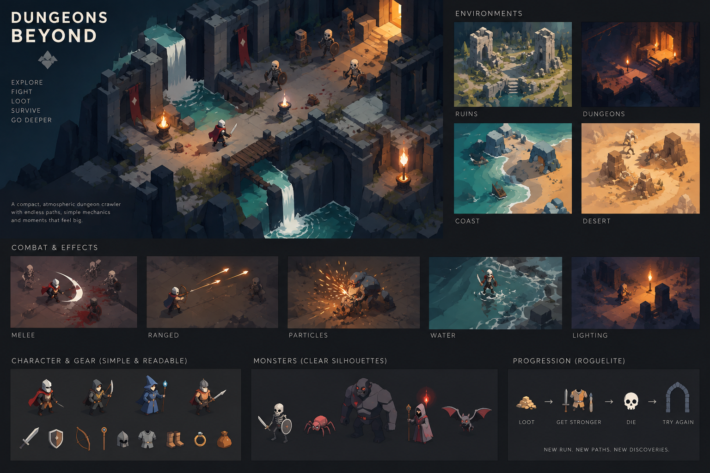

# Astralite — The Drowned Keep

> **Reference note:** The image above is a mood and art-direction reference, not a screenshot or a literal feature specification. It captures the desired readable isometric composition, ruined environments, dramatic lighting, clear combat silhouettes, and compact roguelite fantasy. The current game has its own drowned-fortress identity and focuses on melee combat rather than every character, weapon, biome, or feature shown in the reference.

## Overview

**Astralite — The Drowned Keep** is a compact isometric action roguelite played in the browser. The player is a lone knight descending through a flooded fortress whose chambers, doors, encounters, and landmarks are rebuilt for every run.

The experience is designed around a simple promise: **explore, fight, grow stronger, and go deeper**. Controls are intentionally small in number, but timing, positioning, enemy tells, the choice of which door to take, hazards, and temporary upgrades give each descent shape. A complete run spans three floors and can be finished in one focused session.

## Core loop

1. Wake in the **Tide Altar**, a lit hall of its own that is the same room every time. The hall is the shop. Every arm stands on its rack in the **armoury**: one you own you take up with the swap key, one you do not stands as a dark silhouette with its price on a plaque, and you can take it up to try in the hall. Hold the swap key for a moment to buy the arm in your hand, or one of the four **upgrade shrines** in the corners (Deep Lungs, Whetted Start, Keen Eye, Second Tide), which show a lit notch for every rank held. Your pearls show on screen in the hall and nowhere else. The altar at its heart opens the same two lists on the pause card, for touch or for reading. **The way down**, a door in the far wall, settles the arm you carry for the descent (one only tried stays behind) and raises a newly generated first floor.
2. Clear the chamber you are in; its doors stay sealed until it is quiet.
3. Fight skeleton guards, evade stalker pounces, and break through wardens.
4. Choose a door with the swap key. Each door shows what waits behind it (a fight, a shrine, a mending, or a purse of experience), and every door leads one layer closer to the stair.
5. Earn experience from enemies and from purse chambers. Clearing a chamber heals nothing: damage is carried from chamber to chamber, and vitality comes back only where you chose it (a mending chamber, a shrine, the quarter of your maximum each new floor restores, and Grave Draught, which is worth 2 vitality a body felled).
6. Rank up and choose boons that improve the current run.
7. Defeat the **boss** that guards the exit. It stands alone in the stair hall, with a health bar at the top of the screen while it fights; its fall unseals the stair. Stand on it and take it with the swap key to review the floor results and descend.
8. Escape after three floors—or fall. Either way the run pays out pearls, and the result card has one button, **Return to the Altar**, which carries you back to the hall to spend them, choose an arm and go down again. There is no instant retry: every attempt leaves from the hall.

## The Drowned Keep

Each floor is a seeded chain of sealed chambers rather than a fixed sequence of arenas. It contains roughly 14–30 chambers assembled from several footprints, each its own island. There are no corridors, bridges, or dead ends: the only way between two chambers is a door on one of the two far walls, taken with the swap key once the chamber you stand in is cleared. Chambers stand in layers, from the Tide Gate (an empty starting chamber; the armoury is in the hall above it) through two or three chambers per layer to the stair hall, and every door leads exactly one layer on, so every path down is the same length. The choice is which door to take, because each door shows what the chamber behind it pays: a purse of experience, a mending, a quiet shrine, or a fight.

The keep mixes ruined stone halls, flooded passages, exposed coastal masonry, crypt-like chambers, wooden crossings, waterfalls, banners, braziers, broken walls, pillars, barrels, and scattered defensive remains. Animated tidal water, cloth, flame, embers, damp stone, torchlight, and cool exterior light give the procedural geometry a coherent sense of place.

Rooms are assigned encounter identities so exploration changes the immediate play pattern:

- **Watch rooms** present direct, readable combat. From the second chamber past the gate on (the first fight, and the first floor's opening halls, are single packs) a watch room (and a purse room, which is a watch room that pays experience) fights in **waves**: the pack that stands in it when you walk in, then a second, and in the later rooms a third, each called only when every body before it is down. Half a second after the last one falls, rings go down on the floor where the next wave will stand (never within reach of the knight), and a moment later the bodies rise on them. The chamber's doors stay barred until the last wave has fallen. **Every wave after the first holds at least one body that fights from range**: an archer (on the first floor too, from a later wave) or, from the second floor, a pyre, so a knight who only steps back from melee has something that punishes it.
- **Ambush rooms** wake hidden enemies after entry.
- **Gauntlets** place timed ember hazards across the arena.
- **Sanctuaries** contain a one-use healing shrine.
- **The stair hall** holds a boss and nobody else, and blocks the stair until it falls.

## Combat and movement

Combat is deliberately built around three verbs: **strike**, **special**, and **dodge** (the dash). Every arm has its own special on a cooldown: the Tideblade lunges along the aim, the Twin Fangs vault a body and stab it in the back, the Salt Spear is thrown and drags its target back, the Warden's Cleaver whirls all the way round, the Bell Maul charges into a slam, the Keep Crossbow draws a heavy bolt that goes through every body on its line and through shields (an ordinary bolt, like ordinary steel, is turned aside by a shield from the front), and its bolts, the heavy one included, hit a boss four times as hard as they hit anything else (a crossbow is for the stair hall as much as for the rooms), and the Tideflask sets off every burning pool at once. Arms are chosen, not found: the racks of the Tide Gate on the first floor hold every arm you have unlocked, a rack is used with the swap key (the arm in your hand goes down on the rack you emptied), and no chamber deeper in the keep holds one. The first door out of the Tide Gate locks the arm for the descent, and the knight starts the next descent holding it. A new save owns only the Tideblade. Movement is screen-relative, attacks can be held to repeat, and a dash can abort a swing before or after the blade is live; while the blade is live, the dash waits for contact to end and then follows. The knight’s swing has anticipation, contact, and recovery phases, allowing attacks to feel responsive without losing visual clarity. A directional slash, hit-stop, particles, sound, recoil, and enemy health bars communicate impact.

Enemy behavior is meant to be learned at a glance. From the first floor (a few) and more on the second and third some bodies are **elites**: an ordinary kind with one modifier, told by the colour it glows, its eyes and a flag on its health bar. **Hasted** (cyan) is faster and tells sooner; **Armoured** (steel) has twice the vitality; **Wrathful** (red-orange) hits harder; **Volatile** (ember) leaves a pool of fire where it falls, so it should not die at your feet. An elite is worth double experience and a pearl of its own. Never a boss, a bonecaller or a rattler.

- **Guards** close distance and pressure the player with basic melee attacks.
- **Stalkers** line up a visible long-range pounce that rewards sidestepping.
- **Wardens** are larger, tougher enemies with wider reach, stronger blows, and committed attacks.
- **Archers** hold their distance and loose bolts across the room (from floor two).
- **Shieldbearers** turn aside ordinary steel from the front; the shield is down while they wind up and recover, and a stagger arm, a flank or a backstab gets past it (from floor two).
- **Pyres** are frail, and the danger is where they die: the fire they leave bites anyone standing in it (from floor two).
- **Bonecallers** never strike; they hold back and call up rattlers, which stand up again as fast as they are cut down while the caller lives. Reach the caller, and everything it called falls with it (from floor three).

Every stair hall holds one **boss**: a huge figure with several moves, each telegraphed on the floor as the ordinary kinds are, whose moves change as it is hurt. Crossing a threshold ends whatever it was winding up, holds it still and untouchable for a second while a ring plays at its feet, and throws the knight clear of its reach; a notice names the change. While a boss is awake and alive a **boss bar** stands at the top of the screen with its name, its vitality and a tick at each threshold, and goes the moment it falls. Felling one pays 100 experience and 10 pearls. The pool bosses (the Drowned Captain, the Tide Hound and the Bastion) hit about half as hard as they did, so a knight who never dodges can win them, and the Pyre Mother's bolts, sweep and ring fire were softened so that none of the four kills a careful knight more than twice as often as another; the Bone King has 630 vitality and hits harder than he did (his swing is 27 before the floor's scaling, 19 before). The Pyre Mother is the shortest fight of the four and the Bone King the longest, with the most vitality of anything in the keep. Floors one and two each deal a boss from a pool of four, never the same one twice in a run; floor three always deals the Bone King.

- **The Drowned Captain**, a huge warden: two heavy swings and a sweep that takes everything round it; below half it adds a pounce across the room.
- **The Pyre Mother** holds off at range: a fan of bolts, and a scatter that marks rings on the floor where the knight has been and lights them as fire. Below half the fan is wider, she adds a close sweep and scatters twice running.
- **The Tide Hound**, a stalker grown huge: long pounces and a swing; below half its tells shorten and its pounces come two at a time, the second beginning the instant the first ends.
- **The Bastion** holds a tower shield square to the front except while it winds up or recovers, behind swings and a sweep; below half the shield breaks and a charge joins them.
- **The Bone King** summons, swings and looses a bolt; below 60% a sweep and a pounce join them, and below 25% he summons on every second move. His rattlers are buried at his feet from the start (the most his worst phase can raise), stand up when he calls them and go back into the ground when cut down while he lives. Felling him crumbles everything he called, standing or buried, and opens the last stair: that is the win.

Enemy windups use visible cues, attacks require a clear path, and bodies keep enough separation to remain readable in groups. **Bodies in a chamber that are ready to swing do not swing together:** the second one holds back (it shows nothing while it waits) until its own windup would end half a second after the last windup running in that room, so you dodge the first and the second is already coming, inside your dash's cooldown. Every windup is still shown for its full length, a boss is outside the rule, and three blows never land inside the knight's brief invulnerability. Damage briefly grants invulnerability, while hazards track their own flare cycle so overlapping threats remain consistent.

## Progression

Experience belongs to the current descent and resets when a new run begins. Defeated enemies and chambers that pay a purse of experience advance the player’s rank. Each rank offers a choice of boons, including improvements to strike strength, reach, dash distance, healing on kills, maximum vitality, and damage resistance.

What survives a descent is **pearls**. Every run, won or lost, banks pearls when it ends: 1 for each fight chamber cleared (a chamber that held a fight, however many bodies its waves dealt; a shrine, the Tide Gate and the stair hall are not counted), 1 more for each elite felled, 10 for each boss, 5 for each floor left behind, and 25 for escaping, so even a death on the first floor pays a handful. Pearls are paid by the chamber rather than by the body because a chamber is the unit a player chooses, and its count a run can reach does not grow when waves deal more bodies. Pearls are shown only at the altar and on the result card, never on the playfield. The result card’s **Return to the Altar** button leads to the hall, where the **Tide Altar** is the one place pearls are spent (walk to it and press the swap key; the shop holds the world still while it is open): it unlocks the six arms beyond the Tideblade, in any order, and sells four small upgrades (Deep Lungs, Whetted Start, Keen Eye and Second Tide, which sets the knight back on his feet once a descent when a blow would kill him). Unlocking an arm does not equip it; the arm is chosen on the racks of the hall before a descent, and settled when you take the way down. Everything together costs 900 pearls. The upgrades are small on purpose (Whetted Start is a quarter of a blade’s bite). With nothing healing between chambers, and Grave Draught worth 2 a kill, the balance bots lose their runs to the last boss and, for the one that never dodges, to the chambers: the bot that dodges 80% of tells escapes about six runs in ten and banks about 106 pearls a run (the whole shop in about nine runs), the bot that dodges 95% about seven in eight, the bot that never dodges none and banks about 34 (about twenty-seven runs to the whole shop), and with every upgrade bought the bot that never dodges escapes about one run in five. The bot that dodges walks into every stair hall at full vitality (most likely the mends and the shrine refill what lands; that is not isolated), so how much the rooms cost a person who does not is the playtest's to say; these are bot numbers.

The game keeps **three save slots**. Choosing ENTER THE KEEP on the title opens a slot picker: three cards, each showing the pearls, the deepest floor, the runs logged and the arms owned in that slot (or “Empty”), each with an Erase that takes two presses. Every slot keeps its own pearls, purchases, arms, deepest descent and run log; settings and key bindings are shared by the device. In the hall, the pause menu has **Leave to Title**, which returns to the picker; mid-run the pause menu has no way out of the run, which ends on its card.

The game remembers, per slot, the deepest descent, the seed of the current keep, the pearls and purchases, and a local history of completed runs, and, per device, settings. Run records include outcome, floor, playtime, rank, experience, kills, the fight chambers cleared, boons, seed, cause of defeat, the arm carried, the upgrades held and the pearls earned. The result card at the end of a run reads from that record: it names what felled the knight, the time, and the boons taken, and a lost run offers only the way back to the hall (a keep seed can still be replayed with the `restart:<seed>` console command, for playtesting). The title menu has a **Copy run log** button that puts the finished-run records of the slot last played on the clipboard as JSON (or shows them in a box to copy by hand if the clipboard refuses), so a playtester can paste them to the developer; only the run records are included, no settings or device data. Otherwise this data stays in the browser and is not sent anywhere.

## Player experience

The permanent HUD stays intentionally minimal (the boss bar is not part of it: it exists only while a boss fights): vitality, the strike, special and dash icons (the special and the dash each with a cooldown sweep), and progress toward the next boon. In the hall, where the knight is not at risk, vitality and rank are not shown. Controls, journey statistics, settings, and the expanded floor map live in menus instead of competing with the playfield. Short room notices communicate meaningful events without turning objectives into a persistent overlay.

Keyboard and touch are first-class inputs. Keyboard bindings can be remapped, and touch supports either a continuous thumbstick or labelled direction buttons alongside separate dash, special, and strike controls. Volume, mute, fullscreen, and reduced-motion settings are saved locally. Reduced motion removes camera shake and animated hurt pulsing while preserving combat timing.

## Direction and design principles

The project’s established principles are:

- **Compact, replayable runs** rather than a long campaign.
- **Readable action** over mechanical clutter or excessive effects.
- **Meaningful procedural variation** through topology, encounters, hazards, and landmarks—not randomness alone.
- **A minimal HUD** with deeper information available on demand.
- **Atmosphere through motion, light, sound, and environment** while keeping silhouettes clear.
- **Fair rules and visible tells**, backed by deterministic gameplay and browser tests.
- **Simple controls with room for mastery** through positioning, timing, route choice, and boon combinations.

## Current form

Astralite is a single-player browser game built with React, Three.js, and TypeScript. Its current playable scope includes procedural three-floor runs of sealed chambers joined by reward doors, arm-based combat with a strike, a special, and a dodge, three save slots, seven arms (six of them unlocked with pearls and chosen on the racks of the Tide Altar's hall), a pearl economy and the Tide Altar, a hall of its own that turns lost runs into upgrades and every attempt's starting point, a bestiary of guards, stalkers, wardens, archers, shieldbearers, pyres, and bonecallers, five bosses that guard the stair of each floor, multiple encounter types, hazards and shrines, run-specific boons, floor results, persistence of the best run, history and purchases, keyboard and multitouch controls, accessibility settings, audio, and deterministic test hooks used for automated playthroughs.

The reference image points toward the broader fantasy: an immediately readable adventure through varied, beautifully lit ruins where every new route feels like another story hidden beneath the waterline.
